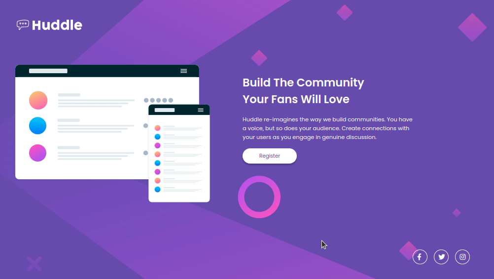

# Desavio HTML-CSS Devquest.
Um desavio feito no curso do Devquest apos a conclusão do HTML e CSS avançado.😊

## Tecnologias utilizadas
- HTML
- CSS

### O que aprendi?
Utilizar as tags do HTML e saber como funciona, como posso colocar e como e quando devo usar. Trabalhar com o CSS para estilizar fonte, backgroud, tudo que envolve a parte do design que é a maquiagem da WEB.😂

### Dificuldades
Bom, CSS tenho um pouco de dificuldade para trabalhar com o responsivel para deixar da melhor forma.🤕

#### Declaração final
Nem tudo é perfeito, porem para quem não sabia nada de HTML e CSS e Hoje sabe colocar um cor de fundo no Body 😁 é gratificante. O Curso Devquest dos Gêmeos tem me dado um foco melhor nos estudo. Obrigado. 🚀🚀🚀